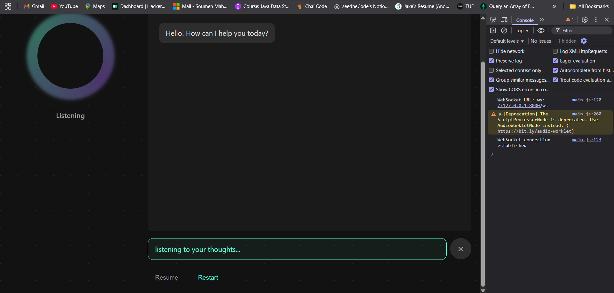
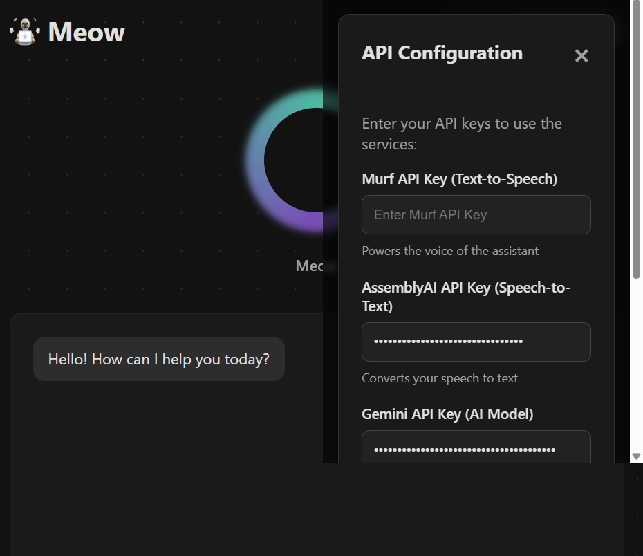

# Murf AI Voice Agent 30DC

A conversational AI assistant web app that enables voice-based chat between users and an AI agent. Users interact by recording their voice, which is transcribed and sent to an LLM agent. The bot responds with both text and synthesized audio, creating a seamless voice chat experience.

---

## Technologies Used
- **Frontend:** HTML, CSS, JavaScript
- **Backend:** Python FastAPI
- **Audio Processing:** Web Audio API, MediaRecorder
- **AI & Speech APIs:**
	- Google Gemini (LLM)
	- Murf (Text-to-Speech)
	- AssemblyAI (Speech-to-Text)

---

## Architecture
- **Client:**
	- Single-page web app
	- Chat window displays user and bot messages (with audio playback)  #upcoming
	- Users record audio, which is sent to the backend
- **Server:**
	- Receives audio, transcribes it (AssemblyAI)
	- Sends transcript to Gemini for response
	- Converts bot response to audio (Murf)
	- Returns both transcript and audio to frontend

---

## Features
- Voice-based chat with AI assistant
- sessionId based conversation management to maintain context
- Audio playback for both user and bot messages
- Modern, responsive UI

---

## Screenshots




---

## Setup & Running

### 1. Clone the repository
```sh
git clone <>
cd Murf30Days
```
### setup project
```sh
python -m venv .venv
.venv/Scripts/activate
```

### 2. Install dependencies
```sh
pip install -r requirements.txt
```

### 3. Set environment variables
Create a `.env` file in the root directory and add:
```
GEMINI_API_KEY=YOUR_GEMINI_API_KEY
MURF_API_KEY=YOUR_MURF_API_KEY
ASSEMBLYAI_API_KEY=YOUR_ASSEMBLYAI_API_KEY
```
Or set them in your shell environment.

### 4. Run the API server
```sh
uvicorn main:app 
```

### 5. Open the app
Visit [http://127.0.0.1:8000](http://127.0.0.1:8000) in your browser.

---

## API Endpoints
- `/transcribe/file` : Transcribes uploaded audio
- `/agent/chat/<session_id>` : Handles chat logic with history context (voice in, bot voice/text out) 
- `/tts/echo` : Text-to-speech for bot replies

---

## Folder Structure
```
main.py
readme.md
.env
requirements.txt
static/
	index.html
	main.js
	robot.png
	style.css
```

---

## License
MIT

